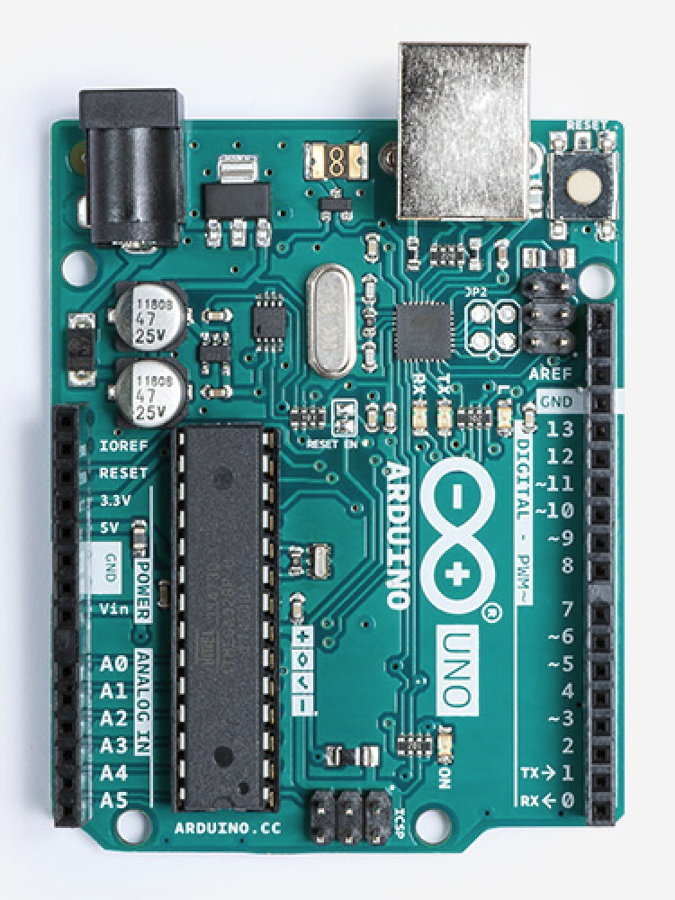

# Rust Zumo STM32

## Purpose

Document process of choosing a robot kit and microcontroller for doing robotics in Rust.

## Robot

The [Zumo Robot for Arduino v1.2](https://www.pololu.com/product/2510) robot kit can be
purchased assembled, which is ideal since I'm more interested in developing
robotics software than assembling the kit.

The robot comes with a variety of sensors which can be used for a number of different
applications, which is quite nice. For example, it comes with line sensors and all
the necessary sensors to make an IMU so it could be used for a robotics localization
application (my first intention).

## Microcontroller (MCU)

### Ecosystem and Compatibility Concerns

The Zumo Robot for Arduino is intended for usage with, well, an Arduino board. In
particular, the Arduino UNO Rev3 appears like it can be attached to the
top of the Zumo without need for doing additional wiring.

However, since I'll be using Rust to program the robot we need to consider that
Rust currently doesn't include AVR architecture as a target for its compiler.
There is a an [effort](https://github.com/avr-rust) within the Rust community
to add AVR as a target, but it's not been upstreamed yet pending additional fixes.

On the other hand, ARM support within the Rust community is quite a bit further along
with a number of resources in the Rust Embedded Working Group
[bookshelf](https://rust-embedded.github.io/bookshelf/). The group has even gotten
Cortex-M bare-metal applications to build with the stable compiler as seen 
[here](https://rust-embedded.github.io/blog/2018-10-28-newsletter-14/).

### Choice of MCU

Given all the above, I've chosen to use an 
[STM32 NUCLEO-F303RE](https://www.st.com/en/evaluation-tools/nucleo-f303re.html)
board which seems to tick both the boxes: compatible with the Rust ecosystem and 
with the Zumo robot.

#### Compatibility with Rust Ecosystem

The board contains an
[STM32F303RET6](https://www.st.com/en/microcontrollers/stm32f303re.html), which is an
ARM Cortex-M4-based core, so it can be used with Rust stable. This is an exciting prospect
since I had assumed I would have to use the nightly compiler for an embedded Rust project
as was the case last time I investigated.

#### Compatability with the Zumo Robot for Arduino v1.2

The STM32 NUCLEO line is intended for pin compatibility with Arduino boards. In particular,
the STM32 NUCLEO-XXXXRX series appears to have the same pinout as an Arduino UNO Rev3.

 

Let's consult the [documentation](resources/zumo_shield_for_arduino.pdf) for the Zumo robot
to find out which pins are used on the Arduino UNO Rev3 for various functionality. 
We'll then cross-reference with the NUCLEO-F303RE [documentation](resources/STM32_Nucleo-64_boards.pdf)
to ensure that the pins are available.

| Arduino Uno Rev3 Pin | NUCLEO-F303RE Pin Available | Purpose                 |
| -------------------- | --------------------------- | ----------------------- |
| D13                  | Yes                         | Yellow LED              |
| D12                  | Yes                         | User Push Button        |
| RESET                | Yes                         | Reset                   |
| D7                   | Yes                         | Right Motor Direction   |
| D8                   | Yes                         | Left Motor Direction    |
| D9                   | Yes                         | Right Motor Speed (PWM) |
| D10                  | Yes                         | Left Motor Speed (PWM)  |
| D3                   | Yes                         | Buzzer                  |
| SCL                  | Yes, named D15              | Inertial sensors        |
| SDA                  | Yes, named D14              | Inertial sensors        |
